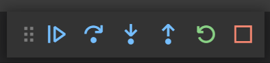

# Lab 07. Debugging

In this folder we have added another function based on contents of the `GetUser.ps1`

Use the `UpdateYear.ps1` file to try out different ways of debugging.

---

- Debug in VS Code
  - Select the `Debug` menu in VSCode 
  - Breakpoint
    - Set a breakpoint on line 16, `$User.age = $User.Age + 1` and run the script in VSCode by pressing the `F5` button
    - Note on the left side you have the `Variables` window. Right click on the `$User` variable, and select `Add to watch`
    - Use the `Watch` windows to see when the content of the `$User` variable changes in different scenarios by clicking the different debugging buttons.
    
      - Continue (F5)
        - Moves on to the next breakpoint
      - Step Over (F10)
        - Steps to the next token, not entering subfunctions.
      - Step Into (F11)
        - Steps to the next token, entering subfunctions.
      - Step Out (Shift+F11)
        - Exit subfunction
      - Restart (Ctrl+Shift+F5)
        - Restart the entire debugging session from the beginning
      - Stop (Shift+F5)
  - Hit Count
    - In the `breakpoints` window in VSCode, click the `edit` button (pen) on the breakpoint created.
    - Set the `hit count` to 5
    - Use the `Watch` windows to see when the content of the `$User` variable is now the fifth element of the user database.
  - Expression
    - In the `breakpoints` window in VSCode, click the `edit` button (pen) on the breakpoint created.
    - Change the `Hit count` value to `2`
    - Add an expression to only count users with the color `Pink`
      - `$User.Color -eq 'Pink'`
    - Run the script and verify the first hit is the second member of Pink Floyd, `Nick Mason`, by comparing the `$User` value to the `$MyUserList` list in the variable window.
- Remove the breakpoint by either
  - putting the cursor on the line of the breakpoint and pressing `F9`
  - Clicking the red dot to the left of the line.

---

- Debug in the shell
  - Line
    - Set a breakpoint on line `16`of the `UpdateYear.ps1` script and run it.
    - Verify you are in a debug session by checking the prompt message. Debug sessions always contain the text `[DBG]`
    - Find all available commands by typing `?` in the console.
    - Test the behaviour and output of the `Step Into`, `Step Over`, and `Step Out` functions
    - Verify the value of the `$User` Variable and see that it updates
    - Type `c` to continue running the script, hitting the breakpoint again, or `q` to break the script right away.
    - Remove the breakpoint

  - Command
    - Create a breakpoint the triggers on the `Set-Content` command _and_ When hitting the breakpoint outputs the $MyUserList variable in csv format  
    - Verify the output, and remove the breakpoint
  - Variable
    - Set a breakpoint on the `User` variable, triggered only when written
    - Verify the breakpoint only gets hit once for every user in the user list.
    - Remove the breakpoint, and set a new one triggered upon both read and write operations
    - Verify the breakpoint is now hit a number of times for each iteration
